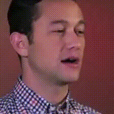
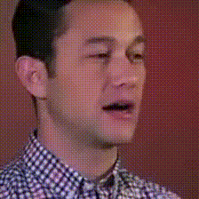
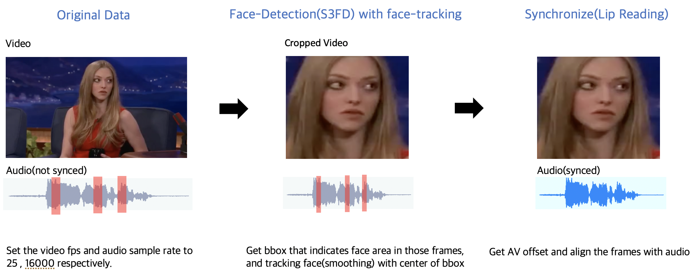

# Video Sychronizer
### Introduction
<p align="center">
 
</p>

This repository provides AV(Audio-Video)synchronization for talking human videos. It uses face-detection model(S3FD) and lipsync model. Thanks for these great works!

__Papers__ :
1. [Single Shot Scale-invariant Face Detector](https://openaccess.thecvf.com/content_ICCV_2017/papers/Zhang_S3FD_Single_Shot_ICCV_2017_paper.pdf)
2. [Out of time: automated lip sync in the wild](https://www.robots.ox.ac.uk/~vgg/publications/2016/Chung16a/chung16a.pdf)

__Git__ : 
1. https://github.com/yxlijun/S3FD.pytorch
2. https://github.com/joonson/syncnet_python

## Usage
1. Synchonize videos with audios automatically.
2. Synced video can be utilized for video-generation(face-reenactment, lip-generation...) task.

## PipeLine
<p align="center">
  
</p>

## Requirements
```bash
conda create -n "video-processing" python=3.7
source activate video-processing

git clone https://github.com/jovis-gnn/video-processing.git
cd video-processing
pip install requirements.txt
mkdir tmp
```

## Download checkpoints
Download pretrained S3FD, lipsync model checkpoints in this [Link](https://drive.google.com/drive/folders/19OkdtsfP9BYplko6EfB5cKIY669BcAnx?usp=sharing). And put them to directories as mentioned below.
```bash
# for S3FD
video-processing/s3fd/weights/
# for lipsync
video-processing/tmp/model_weight/
```

## Execute
❗ It assumes that one person appears in every video frame.  
💡 It can process single video for demo, and multiple videos for preprocessing.

### For single video

1. Input data
```bash 
video-processing/test/test_video.mp4
```

2. run
```bash
cd video-processing
python main.py \
--data_path test/test_video.mp4 \
--single_video \
--del_orig \
--check_after_sync
```

### For multiple videos

1. Input data
```bash
video-processing/test/videos/video_names_0/video_0.mp4
video-processing/test/videos/video_names_0/video_1.mp4
...
video-processing/test/videos/video_names_k/video_k.mp4
```

2. run
```bash
cd video-processing
python main.py \
--data_path test/videos \
--ds_name custom \
--del_orig \
--check_after_sync
```

### Result
Processed result wil be saved next to input directories with suffix '_prep'. Result contains contents like:  
1. Original audio & video
2. Synced audio & video
3. Synced video frames
